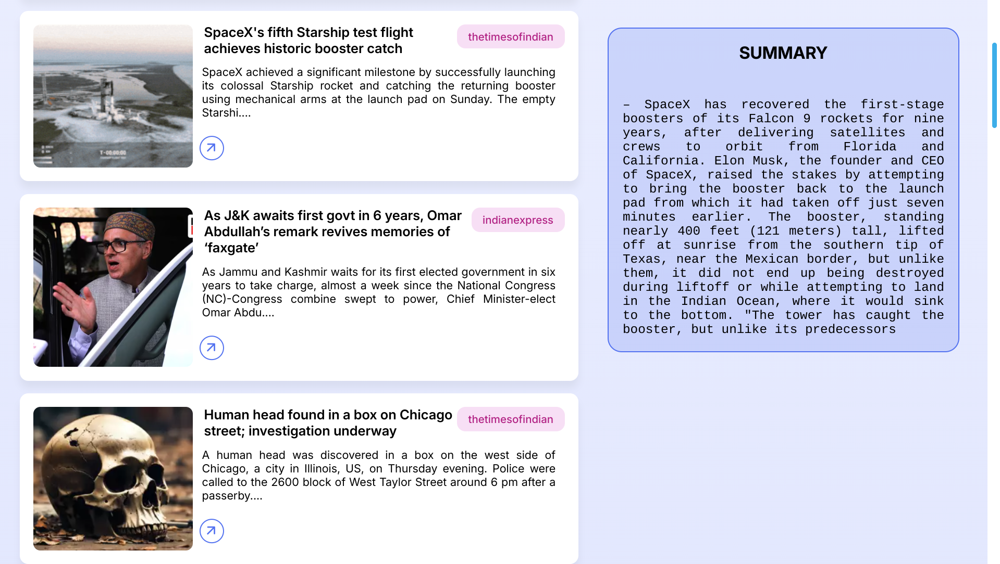

# News API

## Overview
The News API is a FastAPI-based project that provides a news summarization and recommendation service using Sentence-BERT and ChromaDB for vector storage. The API fetches news from supported websites (e.g., Indian Express) by scraping them and stores the data in a SQLite database. Summarized and similar news articles can be retrieved, and users need a token to access the API, which is created during the login process. The service maintains a cache of articles up to one month old.

## Features
- **News Summarization**: Summarizes the scraped news articles using Sentence-BERT.
- **Similar News Recommendations**: Provides similar news articles based on the content.
- **Token-Based Authentication**: Users must be authenticated to access the API, and a token is generated upon login.
- **SQLite Database Storage**: Stores all scraped news articles in a SQLite database for up to one month.
- **News Scraping**: Fetches news from supported websites, currently including:
  - Indian Express
  - Times Of India

## Installation

1. Clone the repository:
   ```bash
   git clone https://github.com/VachhaniJanak/news_api.git
   ```

2. Install dependencies:
   ```bash
   pip install -r requirements.txt
   ```

3. Run the FastAPI application:
   ```bash    
   cd NAS_api
   python3 main.py
   ```

## API Endpoints

### User Authentication

#### Login
- **URL**: `/login`
- **Method**: `POST`
- **Request Body**:
  ```json
  {
     "email": "string",
     "password": "string"
  }
  ```
- **Response**:
  ```json
  {
     "operation": true,
     "token_id": "string",
     "username": "string",
     "message": "string",
     "error": "string"
  }
  ``` 
  
#### Create
- **URL**: `/create`
- **Method**: `POST`
- **Request Body**:
  ```json
  {
     "username": "string",
     "email": "string",
     "password": "string"
  }
  ```
- **Response**:
  ```json
  {
     "operation": true,
     "token_id": "string",
     "username": "string",
     "message": "string",
     "error": "string"
  }
  ```

### News Summarization


#### Get Summarized News
- **URL**: `/summary`
- **Method**: `POST`
- **Request Body**:
  ```json
  {
     "token_id": "string",
     "article_id": 0
  }
  ```
- **Response**:
  ```json
  {
     "operation": true,
     "summary": "string",
     "message": "string",
     "error": "string"
  }          
  ```
### Similar News

#### Get Similar News
- **URL**: `/similar`
- **Method**: `POST`
- **Request Body**:
  ```json
  {
     "token_id": "string",
     "article_id": 0,
     "query": "string",
     "upto": 0
  }
  ```
- **Response**:
  ```json
  {
  "operation": true,
  "articles": [
    {
      "id": 0,
      "headline": "string",
      "description": "string",
      "datetime": "2024-10-11T18:21:35.660Z",
      "img_url": "string",
      "context": "string",
      "url": "string",
      "site_name": {
        "name": "string"
      },
      "writer": {
        "name": "string"
      },
      "news_type": {
        "type": "string"
      }
    }
  ],
  "message": "string",
  "error": "string"
  }
  ```

### Fetch News
- **URL**: `/articles`
- **Method**: `POST`
- **Request Body**:
  ```json
  {
     "token_id": "string",
     "from_count": 0
  }
  ```
- **Response**:
  ```json
  {
     "operation": true,
     "articles": [
    {
      "id": 0,
      "headline": "string",
      "description": "string",
      "datetime": "2024-10-11T18:27:18.836Z",
      "img_url": "string",
      "context": "string",
      "url": "string",
      "site_name": {
        "name": "string"
      },
      "writer": {
        "name": "string"
      },
      "news_type": {
        "type": "string"
      }
    }
  ],
  "message": "string",
  "error": "string"
  }      
  ```

## Bugs and Known Issues
- **Summarization**: The summarization model does not always produce perfect results and may miss key points in some cases.
- **Other Bugs**: There may be occasional bugs related to article fetching, authentication, or recommendation accuracy.

## Future Improvements
- **Model Optimization**: Improving the summarization algorithm to generate more accurate summaries.
- **Expand Supported Websites**: Adding more news sources to the scraping service.
- **Error Handling**: Enhanced handling of edge cases and better bug management.
  
## Tech Stack
- **Framework**: FastAPI
- **Database**: SQLite
- **Text Embedding**: Sentence-BERT
- **Vector Database**: ChromaDB
- **Web Scraping**: Custom Scraper

          
## Demo UI
- Image of frontend.
